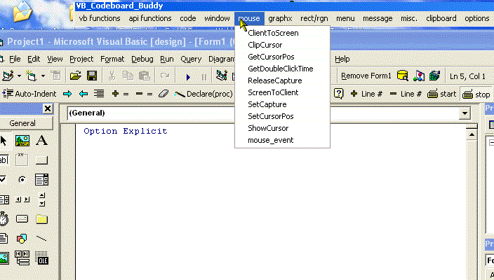



## VB API coding assistant \(updated\)

### Description

If you havent heard about it..the api assistant is your api best friend. The api assistant is a thin, unobtrussive strip that sits at the very top or very bottom of your screen (a full 22 pixels high). It is a library of close to 200 of the most common api calls. Here is how it works. Your working on your project..you realize you need the api call "SetWindowPos" Just click on that item (everthing in the api assistant is alphabetized for fast access), click back on your project and the api call is instantly pasted into your project..followed immediately by a window that contains all of the constants or types that that api call would need. Its a huge time saver. Other time saving features of the api assistant also include the skeleton coding of all the most common vb calls. for instance..click the vb functions menu item "select case", an input box asks you how many cases you want..you enter 4...click in your project and instantly a 4 case select case skeleton structure is typed into your project where you clicked. the VB API assistant also has a small, but, evergrowing menu list of functions to also assist you. And just in case this program doesnt give you a specific api solution for you, there is a menu of other api resources for you as well. sorry for the large screenshot movie (2mb) but i felt it was necessarry to communicate what the program does..you know..a picture and a thousand words
 
### More Info
 

             |
---                |---
**Submitted On**   |2005-02-18 22:34:20
**By**             |[Evan Toder](https://github.com/Planet-Source-Code/PSCIndex/blob/master/ByAuthor/evan-toder.md)
**Level**          |Intermediate
**User Rating**    |4.9 (54 globes from 11 users)
**Compatibility**  |VB 3\.0, VB 4\.0 \(16\-bit\), VB 4\.0 \(32\-bit\), VB 5\.0, VB 6\.0
**Category**       |[Custom Controls/ Forms/  Menus](https://github.com/Planet-Source-Code/PSCIndex/blob/master/ByCategory/custom-controls-forms-menus__1-4.md)
**World**          |[Visual Basic](https://github.com/Planet-Source-Code/PSCIndex/blob/master/ByWorld/visual-basic.md)
**Archive File**   |[VB\_API\_cod1854622182005\.zip](https://github.com/Planet-Source-Code/evan-toder-vb-api-coding-assistant-updated__1-58995/archive/master.zip)

